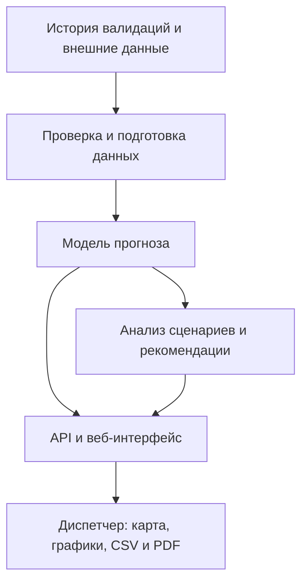

# Как устроено решение

Данные проходят подготовку, после чего модель оценивает спрос по маршрутам и часам. Отдельный расчёт позволяет сравнить обычную ситуацию с заданными событиями. Пользователь видит результат в одном интерфейсе и может выгрузить его.

## Развёртывание
Приложение и модель работают в одном Docker-контейнере с 2 CPU / 2 ГиБ RAM. HTTPS обслуживает отдельный прокси. В тесте сертификат признан доверенным, cookie входа имеет Secure и HttpOnly. Рабочие данные и модель загружаются локально: для каждого открытия карты или прогноза не требуется скачивать погоду заново.

## Развитие масштабирования
Для увеличения нагрузки на чтение можно запускать одинаковые экземпляры модели за распределителем запросов. Однако годовые расчёты сейчас привязаны к памяти конкретного экземпляра. Следующий шаг — общая очередь расчётов и общее хранилище результатов, единая конфигурация сессий, затем тест двух реплик и отказа одной из них. Устойчивость при таком отказе текущими измерениями не подтверждена.

## Разделение ответственности
- Подготовка данных: проверка расписания, дубликатов, статусов и связи с остановкой.
- Модель: прогноз валидаций, календарные и погодные поправки.
- Анализ: агрегирование, сценарии событий, условный резерв.
- Веб-сервис: доступ, параметры запросов, графики, карта и выгрузка.

Технические точки входа и инструкция запуска вынесены в service/README.md, чтобы основной отчёт оставался понятным без чтения кода.
